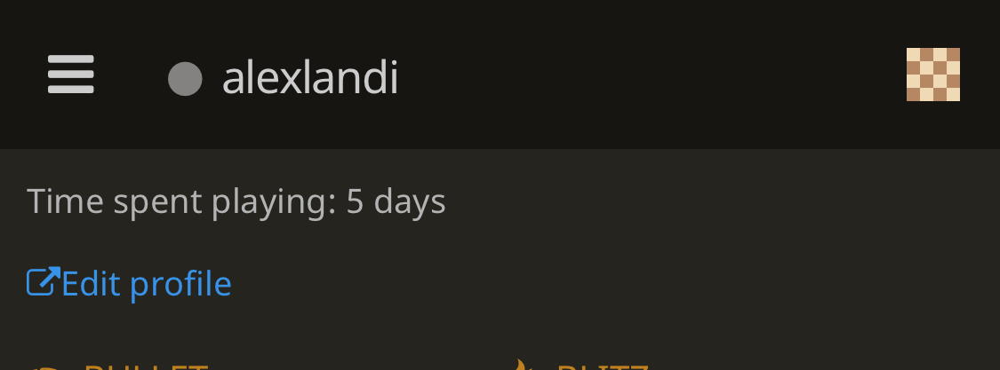

Ironically, whenever I've thought about Open Source Development I've always had this sense that it's inaccessible. Mind you, that could be my irrational fear. However, it's hard not to think about Open Source Development as being comprised of highly motivated, monolithic developers who create projects that make the world go round. I think using this description, Linus Torvalds and Linux come to mind as well as GNU. To me, it's hard not be intimidated by these projects, and the community of developers that maintain them. Linus is notorious for being blunt and "mean" and I think some of that attitude has been influential, especially on forums like StackOverflow (the acronym RTFM comes to mind). Nevertheless, it's difficult not to encounter and/or use projects created by the Open Source community. Two of my main tools that I use for my web development projects are Flask and MongoDB, both completely Open Source. 

Even in my free time I've spent a significant portion of time solivng puzzles on lichess, which is a chess platform that is completely Open Source.

With this in mind, I think my main motivation for taking this class was to find a way to break into the Open Source community. I've always had a want to contribute to an Open Source project but have always been intimidated to do so. The Open Source community has been able to create, maintain, and adapt to so many problems that companies have been unwilling or unable to solve. The "free-libre" philosophy is genuinely motivating and makes me happy that the programming community created ways to make software accessible. I think this week's readings have made me more excited than intimidated to start contributing.